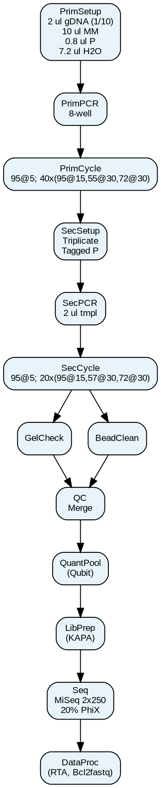

## 1. Conventions for Graphical Representation

### A. Node Label Format

- **Action Keyword:**  
  Use a short, descriptive verb or abbreviation that captures the step’s function (e.g., “PrimSetup,” “PrimPCR,” “QC,” “Seq”).
  
- **Reagent/Parameter Details:**  
  List only the essential reagents, volumes, and ratios in abbreviated form.  
  - Example abbreviations: “ul” for microliters, “deg C” for degrees Celsius.  
  - For cycling, use a concise notation like:  
    - **“95@5”** meaning “95 deg C for 5 minutes”  
    - **“40x(95@15,55@30,72@30)”** meaning “40 cycles: 95 deg C for 15 s, 55 deg C for 30 s, 72 deg C for 30 s.”

- **Minimal Text:**  
  Keep each node’s text to one or two lines at most. Include only the most critical numbers and reagents.

### B. Node Naming Conventions

- **Unique and Consistent IDs:**  
  Each node should have a unique identifier (e.g., A, B, C, …) and a label that uses the convention above.
  
- **Abbreviated Descriptions:**  
  Use standardized short names for common steps:
  - Primary Setup: “PrimSetup”
  - Primary PCR: “PrimPCR”
  - Primary Cycling: “PrimCycle”
  - Secondary Setup: “SecSetup”
  - Secondary PCR: “SecPCR”
  - Secondary Cycling: “SecCycle”
  - Quality Control: “QC” (with subnodes if there are parallel checks like “GelCheck” and “BeadCleanup”)
  - Quantification/Pooling: “QuantPool”
  - Library Preparation: “LibPrep”
  - Sequencing: “Seq”
  - Data Processing: “DataProc”

### C. Graph Structure Rules

- **Sequential Flow:**  
  Use directed edges (arrows) to represent the order of operations.

- **Parallel Steps:**  
  When a protocol step splits into two (or more) concurrent processes:
  - **Fork:** Split the arrow into two or more nodes.
  - **Merge:** Later join these parallel branches with a common node.
  
- **Optional or Conditional Steps:**  
  (If needed, you can represent these using diamond-shaped nodes in DOT; however, in minimal graphs, you may simply note these steps with an asterisk or shorthand.)

---

## 2. Rules for Specific Cases in Protocols

1. **Reagent Mixes / Setup Steps:**  
   - Use a node with a short label (e.g., “PrimSetup”) and list the key reagent volumes and ratios.
   - Example:  
     ```
     PrimSetup: 2 ul gDNA (1/10), 10 ul MM, 0.8 ul Primer, 7.2 ul H2O
     ```

2. **PCR Amplification:**  
   - Use a node labeled “PrimPCR” or “SecPCR” with a note such as “8-well tubes” or “Triplicate reactions.”
  
3. **Cycling Conditions:**  
   - Represent using shorthand. For example:  
     - Primary: “PrimCycle: 95@5; 40x(95@15,55@30,72@30)”  
     - Secondary: “SecCycle: 95@5; 20x(95@15,57@30,72@30)”
  
4. **Quality Control Steps (QC):**  
   - If there are two parallel QC processes (e.g., gel check and bead cleanup), create two parallel nodes (“GelCheck” and “BeadCleanup”) and merge them afterward with a “QC” join node.
  
5. **Quantification, Library Prep, and Sequencing:**  
   - Keep labels short: “QuantPool,” “LibPrep,” “Seq.”
   - Only include key details such as instrument names or key parameters (e.g., “MiSeq 2x250; 20% PhiX”).

6. **Data Processing:**  
   - Use a node labeled “DataProc” with the core tools mentioned (e.g., “RTA, Bcl2fastq”).

---

## 3. Reusable Prompt Template

You can use the following prompt to instruct an LLM (or as guidelines for manual conversion) to convert a protocol into a DOT graph:

---

**Prompt Template:**

> **Task:**  
> Convert the following detailed protocol into a minimal, structured graph representation using Graphviz DOT format.
> 
> **Instructions:**
> 1. **Node Labels:**  
>    - Each node must have a short, unique label (one or two words) that defines the step (e.g., “PrimSetup”, “PrimPCR”, “QC”, “Seq”).
>    - Include only essential reagent volumes and ratios using abbreviated notation. For example, use “ul” for microliters, “deg C” for temperature, and a shorthand for cycling (e.g., “95@5; 40x(95@15,55@30,72@30)”).
> 
> 2. **Graph Structure:**  
>    - Arrange nodes sequentially to represent the order of operations.
>    - If there are parallel steps (e.g., separate quality control processes), split the flow into parallel branches and merge them later.
> 
> 3. **Output Format:**  
>    - Provide the output as a Graphviz DOT file.
> 
> **Example Input Protocol Excerpt:**  
> "Primary PCR Setup: 2 ul gDNA extract (1:10), 10 ul Hotstar MasterMix, 0.8 ul Primer each, 7.2 ul water. Primary PCR in 8-well tubes. Primary Cycling: 95 deg C for 5 min; then 40 cycles of 95 deg C 15 s, 55 deg C 30 s, 72 deg C 30 s; hold at 4 deg C."
> 
> **Your Output:**  
> (Provide a DOT file representation following the above rules.)
> 
> **Detailed Protocol:**  
> [Insert full protocol text here]

---

## 4. Example DOT File Based on These Conventions

Here’s an example DOT file that follows these rules (with a parallel QC branch):




You can use this convention and prompt template as a guideline to automatically (or manually) transform detailed protocols into a minimal DOT/Graphviz representation that is easy to visualize and analyze.
